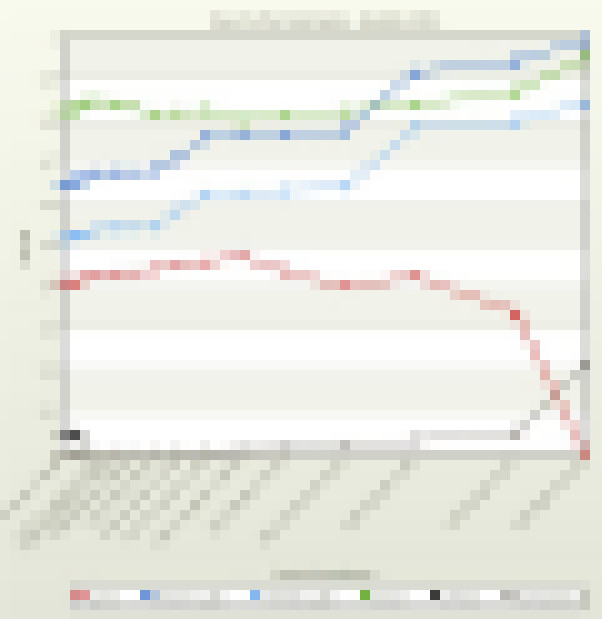
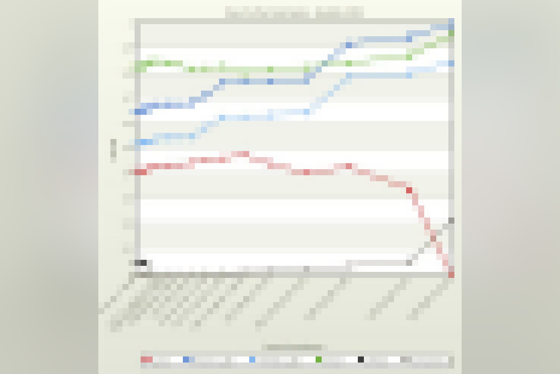
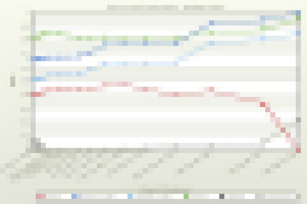
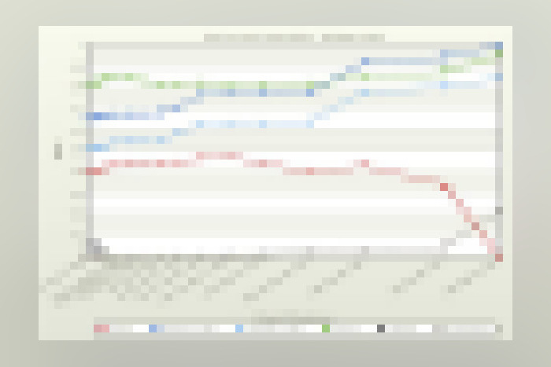
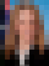
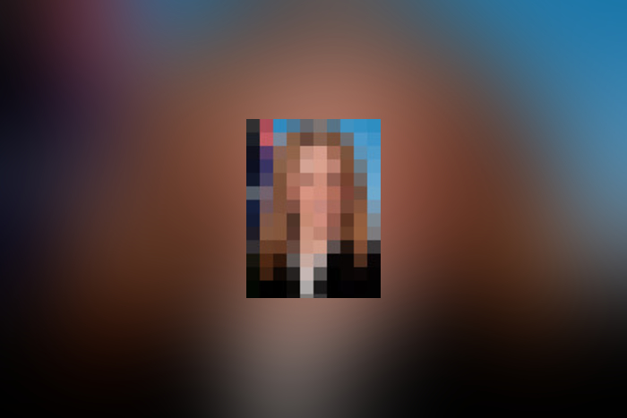
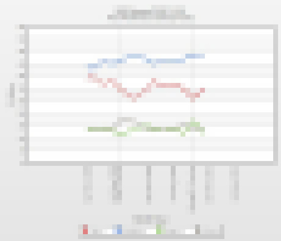
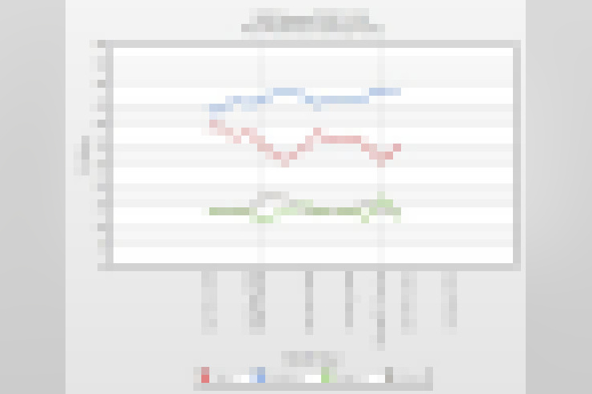

Bash script to resize images to a particular ratio, with a blurred background
where the image is not in the same ratio.

By default this converts to 3x2 ratio, with a min-width ot 700 px.

Run on a single file with:
```
./go.sh <filename>
```

Run recursively finding all .jpgs in a folder with:
```
./go_in_folder.sh <folder>
```
# Examples
## Squareish image
The original source image is resized to fit inside the 3x2 frame




## Wide source image
Both wide and tall images are supported by this script




## Tiny source images
Tiny source images will be scaled up 150% so they're legible on mobile, but remain centered in the overall image.




## Background blur example
The background blur effect means the colour and theme is continued throughout the image



